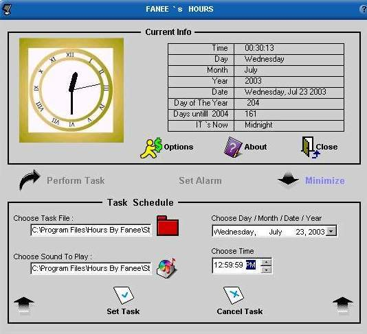



## Alarm task Schedule

### Description

Project includes an Analog clock,An Alarm Clock,A Task Schedule .. And It tells current info about year and time like it`s midnight/evening.you can select date and time for alarm and task.Please Vote ..
 
### More Info
 

             |
---                |---
**Submitted On**   |2003-07-23 00:24:42
**By**             |[Malik Farhan Hussain](https://github.com/Planet-Source-Code/PSCIndex/blob/master/ByAuthor/malik-farhan-hussain.md)
**Level**          |Intermediate
**User Rating**    |4.8 (19 globes from 4 users)
**Compatibility**  |VB 6\.0
**Category**       |[Complete Applications](https://github.com/Planet-Source-Code/PSCIndex/blob/master/ByCategory/complete-applications__1-27.md)
**World**          |[Visual Basic](https://github.com/Planet-Source-Code/PSCIndex/blob/master/ByWorld/visual-basic.md)
**Archive File**   |[Alarm\_task1618937232003\.zip](https://github.com/Planet-Source-Code/malik-farhan-hussain-alarm-task-schedule__1-47110/archive/master.zip)

